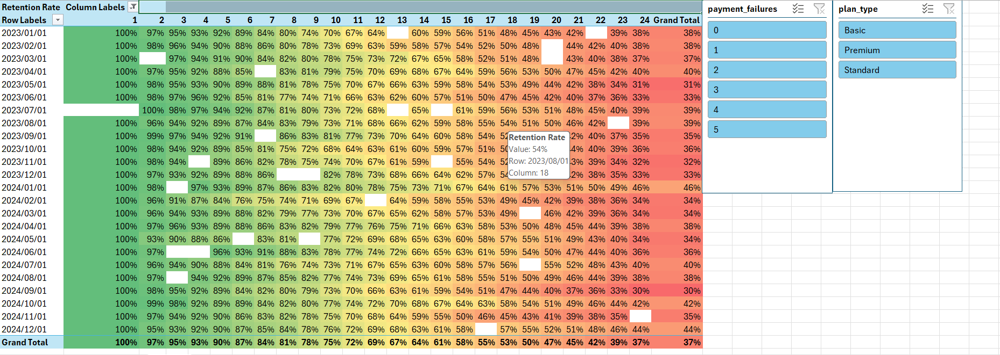

# Executive Presentation: Customer Retention & Churn Optimization Analysis
**Target Audience:** Marketing Leadership, Growth Teams, and Executive Stakeholders
**Authors:** Data Analyst Portfolio Project

---

## Executive Summary: The Retention Landscape

Acquiring a new customer takes 5x more than retaining an existing one. This analysis delivers an end-to-end, cohort-based diagnostic of our customer lifecycle, mapping exactly *when*, *why*, and *where* users drop off.

By identifying critical "churn cliffs" in the customer journey, thius project provides the Marketing and Growth teams with the exact timelines needed to deploy targeted, proactive retention campaigns to protect monthly recurring revenue(MRR). 

### Core Visual: Customer Lifecycle Drop Off Matrix

## Key Strategic Insights for Marketing

###  1. The Onboarding Win(Months 1-3)
* **The Data:** retention holds strong between **95% and 98%** through the first 90 days.
* **Strategic Takeaway:** Our initial onboarding sequence and welcome campaigns are highly effective. Customers quickly realize the product's core value upon signup.

### 2. The 12-Month Renewal "Cliff" (Action Required)
* **The Data:** A massive, uniform drop-off occurs between **Month 11 and Month 14**, where retention dips below **70%**.
* **Strategic Takeaway:** This indicates a severe post-year engagement wall. Marketing should launch automated win-back and loyalty incentives at **Month 10** (60 days *before* the cliff) to secure annual renewals before users check out mentally.

### 3. The Long-Term Baseline (Month 24)
* **The Data:** The customer lifecycle stabilizes at a **37% retention baseline**  by Month 24.
* **Strategic Takeaway:** This 37% represents our ultra-loyal core user base. Growth teams can leverage this cohort for lookalike modeling to optomize paid acquisition targeting toward high-lifetime value(LTV) profiles.

---

## The Analytics Engine(Under the Hood)

To build this dynamic presentation asset, raw, imperfect transactional data was modeled and transformed into a high-performance analytics solution:

* **Data Engineering and Local Handling:** Cleaned missing values and transformed data types, successfuly debugging regionale system locale errors to ensure seemless database ingestion.

* **Advanced Data Modeling:** Built a robust relational schema within the **Excel Power Pivot x DAX Engine**, transitioning the project from flat-file processing to a structured data model.

* **Custom DAX Cohort Logic:** Authored advanced time-intelligent DAX measures using  'CALCULATE','ALLEXCEPT', and filter context overrides to calculate accurate historical drop-off curves dynamically.

* **Executive Visualization:** Applied an optomized conditional formatting heatmap matrix, abstracting backend technical complexity into a clean, scannable corporate asset.

---

## Technical Problem-Solving Highlights

### 1. Handling Regional System Locale Discrepancies

* **Challenge:** Encountered structural calculation errors where decimal formats and commas caused standard numerical fields to evaluate incorrectly within the DAX engine.

* **Resolution:** Re-engineered the data ingestion pipeline using Power Query to explicitly enforce correct data types and regional locale transformations prior to loading into the data model.

* ## 2. Resolving Evaluation Context Conflicts in DAX
  
* **Challenge:** Standard aggregate filters interacted poorly with the Pivot Table row/coloumn layout, initially forcing individual cell values to show up either 100% or 0% across the matrix.

* **Resolution:** Overrode the default evaluation context by crafting a robust DAX measure leveraging 'ALLEXCEPT' and 'FILTER' functions. This allowed the calculation engine to bypass cell-level layout restrictions and compute precise historical drop-off percentages uniformly.

---

## Marketing Action Items

1. **Implement Month 10 Triggers:** Deploy targeted email flows, specialized feature highlights, or renewal discounts specifically targeting accounts hitting 10 months of active tenure.

2. **LTV-Driven Ad Targeting:** Feed the data profiles of the 24-month retained cohort back into ad platforms to optimize marketing spend toward long-term retention. 
